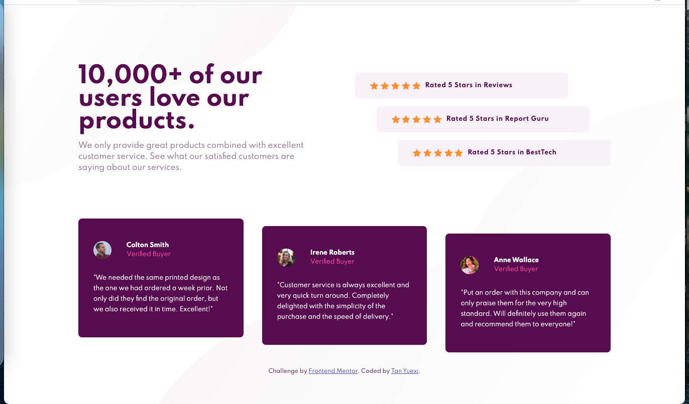

# Frontend Mentor - Social proof section solution

This is a solution to the [Social proof section challenge on Frontend Mentor](https://www.frontendmentor.io/challenges/social-proof-section-6e0qTv_bA). Frontend Mentor challenges help you improve your coding skills by building realistic projects.

## Table of contents

- [Overview](#overview)
  - [The challenge](#the-challenge)
  - [Screenshot](#screenshot)
  - [Links](#links)
- [My process](#my-process)
  - [Built with](#built-with)
  - [What I learned](#what-i-learned)
  - [Continued development](#continued-development)


## Overview

### The challenge

Users should be able to:

- View the optimal layout for the section depending on their device's screen size

### Screenshot




### Links

- Solution URL: <https://github.com/tanyuexi/frontendmentor-social-proof-section-v2>
- Live Site URL: <https://tanyuexi.github.io/frontendmentor-social-proof-section-v2/>

## My process

### Built with

- Semantic HTML5 markup
- CSS custom properties
- Flexbox
- Mobile-first workflow
- [Sass](https://sass-lang.com/) - Sass: CSS pre-processer


### What I learned

#### Flexbox

Put horizontally arranged items in a flex container. The direct child `<div>`s are items:

```css
.flex-container {
  display: flex;
  flex-direction: row;
  flex-wrap: wrap;
  align-items: center;
  justify-content: space-between;
}
```

### Continued development

Learn about CSS Grid and React.
